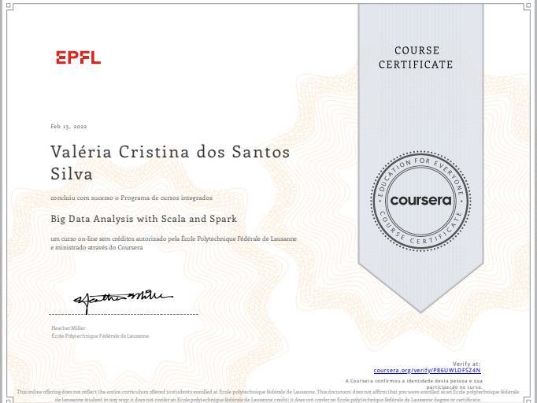

# Coursera Spark Scala

Repositório dedicado aos exercícios do curso [Big Data Analytis with Scala and Spark], que tem o objetivo:

- Ler dados de armazenamento persistente e carregá-los no Apache Spark.
- Manipular dados com Spark e Scala. 
- Expressar algoritmos para análise de dados em um estilo funcional. 
- Reconhecer como evitar shuffles e recomputation no Spark.

## Exercícios Práticos

### [Exercício Prático : Example](https://github.com/vvalcristina/Coursera-Spark-Scala/tree/main/example)

* **Semana :** 1
* **Exercício:** Usando o Scala REPL, Usando a ferramenta SBT
* **Descrição:** O objetivo desta tarefa é familiarizar-se com a infraestrutura e as ferramentas necessárias durante esta aula. 
* **Nota:** 10/10

### [Exercício Prático: Wikipedia](https://github.com/vvalcristina/Coursera-Spark-Scala/tree/main/wikipedia)

* **Semana :** 1
* **Exercício:** Noções básicas dos RDDs do Spark
* **Descrição:** Vamos utilizar os dados de texto completo da Wikipedia para produzir uma métrica rudimentar do quão popular é uma linguagem de progração, em um esforço para ver se nossos rankings baseados na Wikipedia, têm alguma relação com o Red Monk.
* **Nota:** 10/10

### [Exercício Prático: StackOverflow](https://github.com/vvalcristina/Coursera-Spark-Scala/tree/main/stackoverflow)

* **Semana :** 2
* **Exercício:** Operações de reduction e pares de chave-valor distribuídos
* **Descrição:** O objetivo geral desta tarefa é implementar um algoritmo k-means distribuído que agrupa as postagens na plataforma do StackOverflow de acordo com sua pontuação. Além disso, esse agrupamento deve ser executado em paralelo para diferentes linguagens de programação e o resultados devem ser comparados.
* **Nota:** 10/10

### [Exercício Prático: Time Usage](https://github.com/vvalcristina/Coursera-Spark-Scala/tree/main/timeusage)

* **Semana :** 4
* **Exercício:** Manipulações de dados com Spark
* **Descrição:** O objetivo geral desta tarefa manipular dados de um dataset de Time Usage para calcular o número de horas gastas em cada atividade (atividades básicas, trabalho e outros) agrupados por situação de trabalho, sexo e idade.
* **Nota:** 08/10

## Certificado

[Big Data Analytis with Scala and Spark]:https://www.coursera.org/learn/scala-spark-big-data

